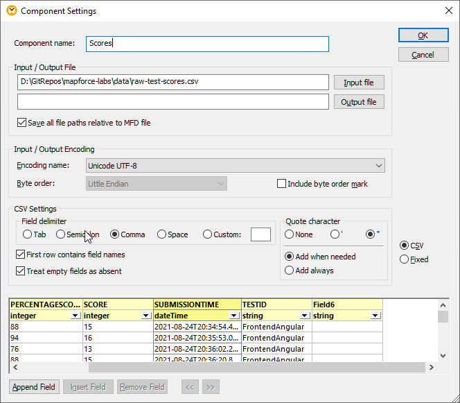

# Introduction to Mapforce

In this exercise you will

* Launch Mapforce
* Create a basic mapping
* Review the results

## Launch Mapforce

1. In your Windows environment, launch **Altova Mapforce 2021**.

2. You will be presented with the Altova Mapforce application which will look something like this:

3. In the left hand pane you will see the libraries. This shows all the functions that are available to you when you are doing your mappings. You will be using some of these later on in the course.

The large pane in the center of the screen is where you will complete your mappings. The bigger your screen the better when using this! In this exercise you will be mapping some student scores to an XML structure for student scores.

4. Although your mapping file is empty at the moment, save the file somewhere on your computer. Use the name **MyFirstMapping**. The extension will be .mfd (Mapforce Designs). 

## Adding Components
Components are the things you map *from* and *to*. You will now add a CSV file to map from, and then an XML Schema to map to.

5. The file you will be converting is this CSV file. So download this file and save it into the folder that contains your **MyFirstMapping.mfd** mapping file.

[Raw Test Scores](data/raw-test-scores.csv)

6. To add this to your mapping pane, click the **Insert Text File**. 

7. At the **Insert Text Component** dialog box, select **Use simple processing for standard CSV**.

8. Click the **Input File** button, and then browse to your **raw-test-scores.csv** file.

9. Select the  **First row contains field names** check box.

10. Set the data types by setting the **PERCENTAGESCORE** and **SCORE** to be an **integer**, and then set the **SUBMISSIONTIME** to be a **dateTime**.

11. Finally change the Component Name to Scores. It should look something like this:

12. Click **OK** and you will now see on your mapping pane a new component which will be the Scores.

13. Now you will add another component to be the structure that we want to map the data into. An XML Schema will be used for this, so now download the following XSD file and save it into the same folder as your mapping and CSV file.

[Scores Schema](schemas/scores.xsd)

14. Now in Mapforce, click on the **Insert XML Schema / File** button and browse to your XML Schema file scores.xsd that you downloaded. 

15. At the dialog box asking if you wish to provide a sample file, choose Skip, since sample files are only relevant if you are mapping *from* the Schema. We are mapping *to* the schema.

Your mapping pane should now look something like this:

## Adding some Mappings

16. Now you will add some mappings. We will begin by saying that 'for every student row we would like a score tag in the XML'. So initially, map from the **Rows** on the left to the **score** on the right. That should mean that for every row there will be a score tag in the XML. To complete this, select and hold your mouse down on the small triangular shaped connector to the right of the word Rows. Keeping the mouse button held down, move your mouse to the triangular shaped connector to the left of the score element in the XML Schema component on the right. Then let go of the mouse. 

It will look like this when you have completed it.

17. Does it work? To find out, click on the Output tab at the bottom of your mapping pane, and you should see a long list of empty <score/> tags inside a single <scores>. Save your mapping.

It is a good idea to constantly be saving your mapping and checking the Output tab to make sure your mappings are correct. It is much easier to do this as you go rather than complete a large mapping and then only look at the end. If it hasn't worked it much harder to know why when you have added large amounts of connectors.

18. Return to the Mapping pane again using the tab at the bottom of the screen.
    
19. Using the same technique as before, now connect the **NAME** to the **studentCode**, and connect the **PERCENTSCORE** to the **percentageScore**. 

20. Save your mapping and review the output again and this time you should see those values added into the output.

## Using Functions

To map the date and time, we will need some functions, since the SUBMISSIONTIME in the input is actually a date-time value. We actually need the date and the time separated. 

21. Review the function pane on the left and note the set of functions called **datetime functions**. Can you see two functions in there that we could use? 

Note the **date-from-datetime** and **time-from-datetime** functions. They should do the trick!

22. To start with the date value, drag the **date-from-datetime** function onto the mapping pane. You will see that it adds the function with an input requiring a datetime, and an output that is a date. 

23. Connect the **SUBMISSIONTIME** to the **datetime** input value, and then connect the **date** output value from the function to the **dateCompleted** on the XML Schema component.

It should look something like this:

24. Check the result by using the Output tab. You will see the dates in the output XML now.

25. Finally repeat the process you just used to map the time. This time you will need the **time-from-datetime** function. You will be mapping the input to the SUBMISSIONTIME again. That is not a problem. 
    
26. Once complete, save and test your mapping again. You now have a fully working mapping!

Your mapping should now look like this:

## Adding a Filter

Currently, all of the records in the CSV are being sent to the output. You will see how to filter out some rows and then sort the remaining rows.

27. To filter out some rows, now select the **Insert Filter** button at the top of the mapping pane. This will add a filter box onto your mapping. Drag it to the top of the screen in between your two components.

28. The condition we want to check is whether the score is greater than 70%, so you now need the GreaterThan Function, so from the **logical functions**, drag on the **greater** function. You might now need to space things out a bit to get some room to join stuff up. Your screen should currently look something like this:

29. Now add a constant for the number 70. You can do that by right clicking anywhere in the mapping pane, and selecting **Insert Constant**. In the dialog box, enter the value of *70* and select that it is a number and click **OK**.

You now have everything you need to connect up your filter.

30. Link the **PERCENTAGESCORE** to the **a** on the greater than. Then link the constant **70** to the **b** value. 

31. Now link the **result** of the **greater**, to the **bool** of the **filter**.

32. Link the **Rows** to the **node-row** of the **filter**.

33. Link the **on-true** of the **Rows** filter to the **score** of the **scores** Schema component. When you do this you will receive a warning that you are replacing a connection or duplicating. Select that you wish to replace the connection.

Your mapping should now look like the following:

34. Test your mapping using the output. You should see no scores below 70%. Change the constant to be 90, and you review the output again. You should now only see scores above 90%.

## Adding a Sort

35. Now we wil get the scores sorted by the name column, so click the **Insert Sort** button.

36. Connect the **on-true** from the **Rows** in the filter, to the **node-rows** of the **sort**.

37. Connect the **NAME** field to the **key** of the **Rows** in the sort component.

38. Finally, connect the **result** of the sort to the **score** in the output, selecting the option to replace the connector.

39. Review the output, and you will notice that the scores are now in alphabetical order by name.

## Further Exploration

If you have time at the end, you could explore some of the following challenges. These will all require the use of various functions.

### Challenge 1 Remove all spaces from the NAME input.

Review the functions in the second set of the string functions (there are two sets!!). There is a function called **replace**. That should do it.

### Challenge 2 Change the NAME input so the values are all in lower case.

Now see if you can also change the case to lower case as well as having the spaces removed. This will involve chaining the output of one function to the input of the next. The function involved is called **lowercase**.

