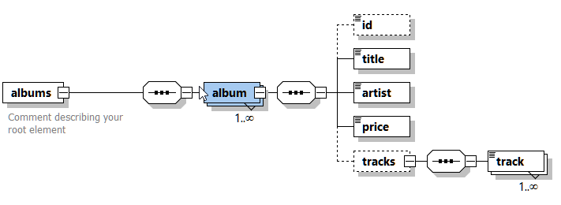
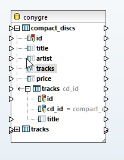
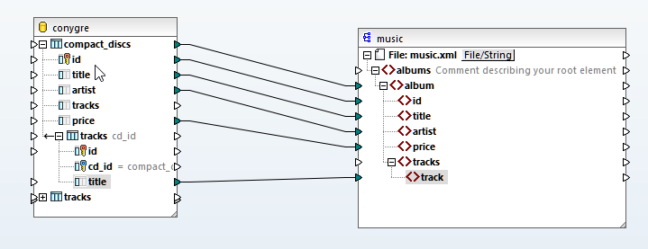
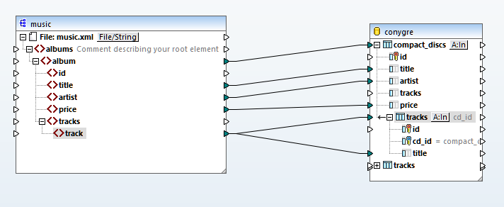
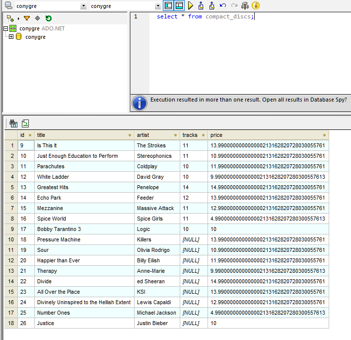

# Mapping to a Database

In this exercise you will create a mapping that will retrieve some data from a database and insert it into an XML file.

The database has two tables. One table called compact_discs contains some music albums, and another table called tracks contains the tracks (although it only has tracks for one of the albums). The two tables are linked with a one to many relationship.

The XML Schema then follows a similar structure but in XML where we have music albums with tracks:



## Set up the Components

1. In Mapforce, select **File** / **New** / **Mapping**.

2. Click on the Insert Database button. You can see a variety of database connection options. Select ADO.NET connections and the select .NET Data Provider for MySQL.

3. For the Connection String, enter the following:

```
Host=localhost; DataBase=conygre; Protocol=TCP; Port=3306; Compress=false; Pooling=true; Min Pool Size=0; Max Pool Size=100; Connection Lifetime=0; User id=root;Password=c0nygre
```

4. Now click **Connect**.

5. You will now be presented with the database table structure. We want to add the *compact_discs* and *tracks* tables. So expand **Tables** and then select **compact_discs** and select **tracks**.

6. The *compact_discs* and *tracks* tables are related, so now click the **Add/Edit Relations** tab.

7. In the **Add/Edit Relations** dialog box, click **Add Relation**.

8. In the **Primary/Unique Key Object**, select the **compact_discs** table, and then for the key, select **id (int)**.

9. In the **Foreign Key Object**, select **tracks** and then for the key select **cd_id**. This informs Mapforce that the tracks are effectively children of the compact discs using the primary key id in the compact_discs table that is referenced by the cd_id in the tracks table. Click **OK** and then click **OK** again.

10. Now in the new component, expand the compact_discs table. You will see that it has a child property of type tracks that can also be expanded.



11. Now add on an XML Schema component based on the following XML Schema file and skip the option to provide a sample file, since the data will be coming from the database table. Save the mapping file as *MySQLMusicToXML.mfd*.

[Music Schema](schemas/music.xsd)

## Add the Mappings

12. Ensure that the **Toggle Autoconnnect of Children** is enabled (it is a button in the top row of buttons).

12. Now link the **compact_discs** connector to the **album** element in the **music** component. This configures that we want a new album for each row.

13. Because the autoconnect of children is on, you should see multiple connectors added in. This is because the names in the database table match the names in the XML Schema. This is very convenient when many of the mapping options are simple.

14. Remove the mapping to **tracks**, since the compact_discs table has a column called tracks which we will disregard. We are only interested in the tracks table.

15. Now finally link the title of the **tracks cd_id** attribute in the database component to the **track** in the **music** component. It should look like this:



16. Try generating the output. You should see the album data and album number 16 has some tracks in it. This data is all in the database.

## Create a new Mapping from XML to the Database

In the example you just created, you copied some data out of a database and into an XML file. What if you wanted to go the other way?

17. In Mapforce, create a new Mapping.

18. Add the Music Schema just like you did in the previous mapping. This time though select that you would like to add a sample file.

19. For the sample file, select the following XML file:

[Music XML File](data/music.xml)

20. Now add on the database component in the same way that you did previously including the relationship between the two tables.

21. Ensure that the auto connect mappings is disabled. 

22. Map the **album** in the **music** component to the **compact_discs** table.

23. Now map the **artist**, **price** and **title** properties.

24. For the tracks, map the **track** element in the XML to the **tracks** table that is part of the **compact_disc** structure. This will mean that you want a new tracks table entry for each track.

25. Finally, map the **track** in the **tracks** element to the **title** column in the **tracks** table. This will mean that track is mapped twice. This is correct.



26. Save the mapping as **XMLMusicToMySQL.mfd**.

27. Click on the **Output** tab. Notice that it doesn't this time actually put data into the database, rather it shows the SQL that could be executed to update the database.

Note the function **LAST_INSERT_ID()**. This is used for the foreign keys which are required for the album that has tracks. Note that each track is inserted with the appropriate foreign key.

28. To execute the SQL, as per the comment, while still in the Output tab, click **Output** and then click **Run SQL Script**.

29. To see if the data has successfully gone into the database, selec the **SQL Query** tab and then select the **conygre** connection from the drop down where it says **offline**.

30. In the query pane where the cursor has been placed, enter the following SQL query:

```
select * from compact_discs;
```

31. Click the yellow Execute button and you will see the data displayed, including your newly inserted albums:




